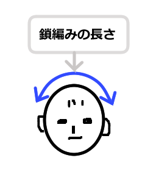

四角いニット帽 Square Beanie
---

かぎ針編みで作る四角い封筒状のニット帽です。かぶると角が猫耳状になります。  
ゲージを気にせず、頭のサイズに合わせながら作ります。

## 必要なもの
- 毛糸 (太い方がざくざく編めて簡単です)
- 毛糸の太さに合わせたサイズのかぎ針
- とじ針

## 作り方概要

鎖編みを作りたい幅まで編む。頭に当ててみて、頭頂部を真ん中にして、だいたい左右のこめかみの位置くらい。※  
鎖編みの周りを細編みでぐるっと編む。  
長編みで作りたい深さまで輪編みで編む。
同じ方向に編むと目が少しずつずれるため、往復編みで編む。表側からは交互に長編みの裏側が見える状態。  
時々かぶってサイズを確認する。
ちょうどよい深さまできたら、後ろ側半分を長編み、その後細編みを1周編んで終了。

※鎖編みの長さの目安   

## パターン

※鎖編みをn目とした場合

1. 鎖編みをn目編む。
2. 鎖編みの周りに細編み(n * 2 + 2)目。端は3目編み入れる。
3. 鎖編み3目で立ち上がり、長編み。立ち上がりの鎖目に引抜き編み。
4. 鎖編み3目で立ち上がり、折り返して長編み。
- 必要な段数まで3-4を繰り返す。  
- 最終段の1段前: 長編みを(n + 2)目編み、その後細編みn目。  
- 最終段はそのまま前段の長編み(n + 2)目に細編みを編む。

## 編み図

  
")

## その他メモ
- 途中、サイズが小さい/大きい場合は、左右の端の部分で均等に目を増減する

## パターン例

- 毛糸: あむころ(モールヤーン)
  - ダイソーにて購入
  - かぎ針目安: 8～10mm
  - 標準ゲージ: 7～8目/10cm
- 使用かぎ針: 8mm
- 頭回り: 約55cm
- 鎖編みの幅: 約22cm

1. 18 - 鎖編み
1. 38 - 細編み
1. 38 - 長編み
1. 38 - 長編み(内側を手前に)
1. 38 - 長編み
1. 38 - 長編み(内側を手前に)
1. 38 - 長編み
1. 38 - 長編み(内側を手前に)
1. 20 - 長編み, 18 - 細編み
1. 20 - 細編み

- 出来上がり例
  
